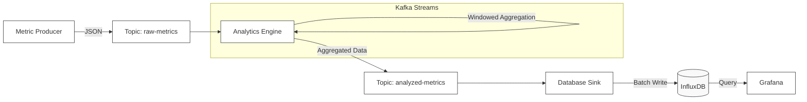

# Distributed Observability Engine


A distributed telemetry pipeline designed to ingest, aggregate, and visualize server metrics. This project implements a Kafka Streams topology for stateful windowed aggregation and a custom InfluxDB sink for persistent time-series storage.

## Technology Stack

* **Core Application:** Java 17, Maven
* **Stream Processing:** Apache Kafka (Kafka Streams API)
* **Time-Series Database:** InfluxDB v2
* **Visualization:** Grafana
* **Infrastructure:** Docker, Docker Compose, Zookeeper
* **Testing:** JUnit 5

## Engineering Highlights

* **Fault Tolerance:** Implemented a Poison Pill pattern in the stream topology. Malformed JSON records are logged and discarded at the ingress point to prevent stream thread crashes.
* **Write Optimization:** The Database Sink implements a manual batching mechanism (flushes every 500 records or 5 seconds) to reduce network overhead to InfluxDB.
* **Windowed Analytics:** Uses 60-second tumbling time windows to calculate min, max, and avg CPU usage in real-time.
* **DevEx & Networking:** Configured a dual-listener Kafka setup (PLAINTEXT for internal Docker traffic, PLAINTEXT_HOST for localhost) to allow local Java processes to communicate with containerized infrastructure.
* **Data Simulation:** The metric producer uses a stateful Random Walk algorithm to generate drifting CPU trends for threshold testing.

## System Architecture

The system follows a standard **Producer → Processor → Sink** pattern, decoupled by Kafka topics.



## Getting Started

### Prerequisites

* Java 17+
* Maven 3.6+
* Docker & Docker Compose

### Build
* Compile the application and run unit tests.
```text
mvn clean package
```
* Start Infrastructure
```text
docker-compose up -d
```
* Initialize Topics

```text
docker exec observability-engine-kafka-1 kafka-topics --create --bootstrap-server localhost:9092 --replication-factor 1 --partitions 1 --topic raw-metrics
docker exec observability-engine-kafka-1 kafka-topics --create --bootstrap-server localhost:9092 --replication-factor 1 --partitions 1 --topic analyzed-metrics
docker exec observability-engine-kafka-1 kafka-topics --create --bootstrap-server localhost:9092 --replication-factor 1 --partitions 1 --topic metric-alerts
```
### Running the Pipeline

To simulate the distributed environment, run the components in separate terminal windows.

Terminal 1: Analytics Engine (The Processor)
```text
java -jar target/observability-engine-1.0.0.jar
```
Terminal 2: Database Sink (The Consumer)
```text
java -cp target/observability-engine-1.0.0.jar com.engine.sink.DatabaseSink
```
Terminal 3: Metric Producer (The Generator)
```text
java -cp target/observability-engine-1.0.0.jar com.engine.producer.MetricProducer
```
## Observability

```text
Grafana Dashboard: http://localhost:3000 (User: admin / Pass: admin)

Visualizes real-time CPU trends, breach counts, and system status.

InfluxDB UI: http://localhost:8086

Tests: Run mvn test to verify aggregation logic.
```
## Configuration

```text
Possible Modifications in Analytics Engine:

WINDOW_SECONDS: Aggregation window size (Default: 60s)

ALERT_THRESHOLD: CPU % that triggers a warning (Default: 85.0)
```

## License
See `LICENSE` for more information.