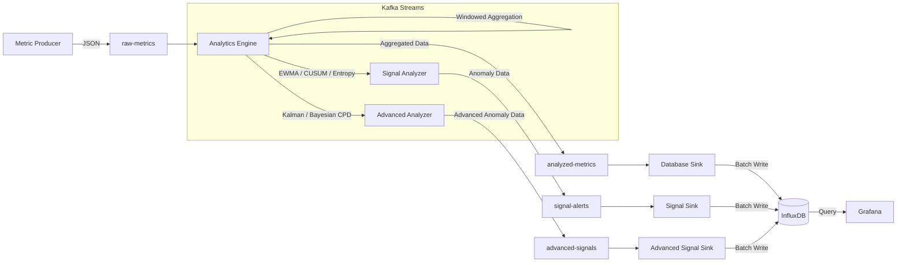
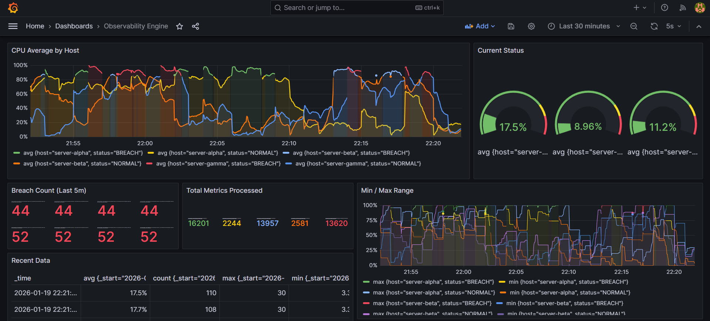
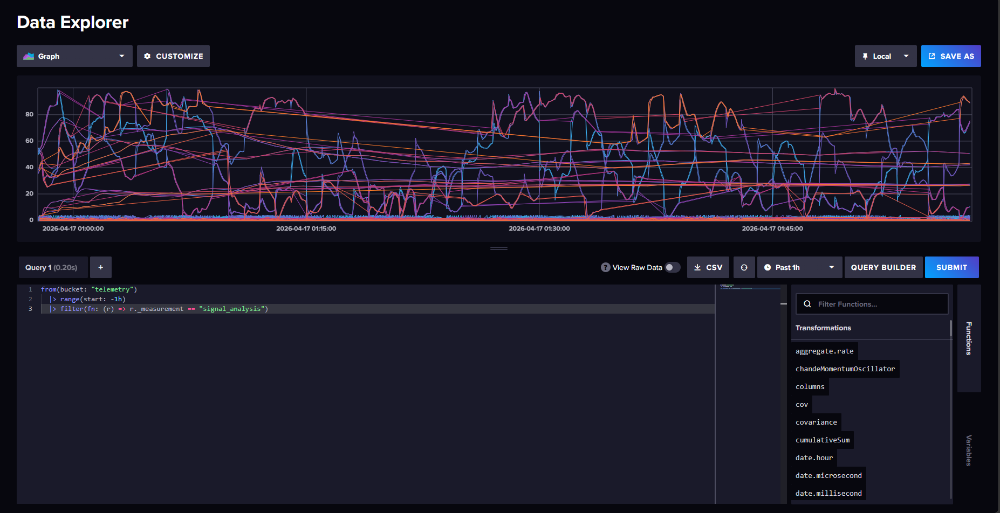
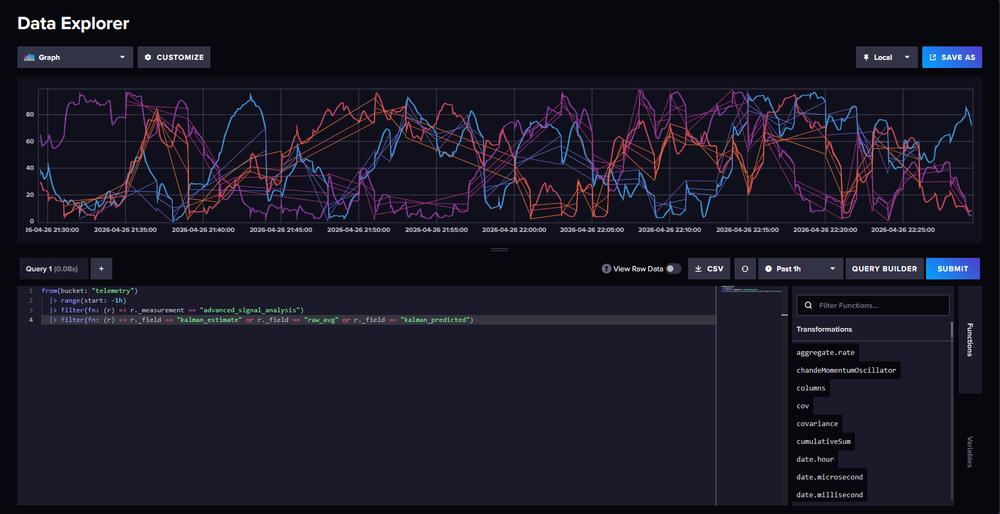

# Distributed Observability Engine

**Tech Stack:** Java 17, Apache Kafka Streams, InfluxDB, Grafana, Docker

A real-time telemetry pipeline that ingests server metrics over Kafka Streams, computes windowed aggregations, runs signal analysis for anomaly detection, and writes results to InfluxDB.

## Engineering Highlights

* **Signal Analysis:** Applies EWMA smoothing, CUSUM change-point detection, streaming Shannon entropy, Kalman filtering, and Bayesian online change-point detection to the aggregated metric stream for anomaly detection.
* **Fault Tolerance:** Implemented a Poison Pill pattern in the stream topology. Malformed JSON records are logged and discarded at the ingress point to prevent stream thread crashes.
* **Write Optimization:** The Database Sink implements a manual batching mechanism (flushes every 500 records or 5 seconds) to reduce network overhead to InfluxDB.
* **Windowed Analytics:** Uses 60-second tumbling time windows to calculate min, max, and avg CPU usage in real-time.
* **Networking:** Configured a dual-listener Kafka setup (PLAINTEXT for localhost, PLAINTEXT_INTERNAL for internal Docker traffic) to allow local Java processes to communicate with containerized infrastructure.
* **Data Simulation:** The metric producer uses a stateful Random Walk algorithm to generate drifting CPU trends for threshold testing.

## System Architecture

The system follows a standard **Producer → Processor → Sink** pattern, decoupled by Kafka topics.


```mermaid
graph LR
    Prod[Metric Producer] -->|JSON| T1[raw-metrics]
    T1 --> Engine[Analytics Engine]
    
    subgraph "Kafka Streams"
        Engine -->|Windowed Aggregation| Engine
        Engine -->|EWMA / CUSUM / Entropy| Signal[Signal Analyzer]
        Engine -->|Kalman / Bayesian CPD| Advanced[Advanced Analyzer]
    end
    
    Engine -->|Aggregated Data| T2[analyzed-metrics]
    Signal -->|Anomaly Data| T3[signal-alerts]
    Advanced -->|Advanced Anomaly Data| T4[advanced-signals]
    T2 --> Sink[Database Sink]
    T3 --> SSink[Signal Sink]
    T4 --> ASink[Advanced Signal Sink]
    
    Sink -->|Batch Write| DB[(InfluxDB)]
    SSink -->|Batch Write| DB
    ASink -->|Batch Write| DB
    DB -->|Query| Dash[Grafana]
```

## Getting Started

### Prerequisites

* Java 17+
* Maven 3.6+
* Docker & Docker Compose

### Build
* Compile the application and run unit tests.
```text
mvn clean package
```
* Start Infrastructure
```text
docker-compose up -d
```
* Initialize Topics

```text
docker exec observability-engine-kafka-1 kafka-topics --create --bootstrap-server localhost:9092 --replication-factor 1 --partitions 1 --topic raw-metrics
docker exec observability-engine-kafka-1 kafka-topics --create --bootstrap-server localhost:9092 --replication-factor 1 --partitions 1 --topic analyzed-metrics
docker exec observability-engine-kafka-1 kafka-topics --create --bootstrap-server localhost:9092 --replication-factor 1 --partitions 1 --topic metric-alerts
docker exec observability-engine-kafka-1 kafka-topics --create --bootstrap-server localhost:9092 --replication-factor 1 --partitions 1 --topic signal-alerts
docker exec observability-engine-kafka-1 kafka-topics --create --bootstrap-server localhost:9092 --replication-factor 1 --partitions 1 --topic advanced-signals
```
### Running the Pipeline

To simulate the distributed environment, run the components in separate terminal windows.

Terminal 1: Analytics Engine (The Processor)
```text
java -jar target/observability-engine-1.0.0.jar
```
Terminal 2: Database Sink (The Consumer)
```text
java -cp target/observability-engine-1.0.0.jar com.engine.sink.DatabaseSink
```
Terminal 3: Signal Sink (Signal Analysis Consumer)
```text
java -cp target/observability-engine-1.0.0.jar com.engine.sink.SignalSink
```
Terminal 4: Advanced Signal Sink (Kalman/Bayesian Consumer)
```text
java -cp target/observability-engine-1.0.0.jar com.engine.sink.AdvancedSignalSink
```
Terminal 5: Metric Producer (The Generator)
```text
java -cp target/observability-engine-1.0.0.jar com.engine.producer.MetricProducer
```

## Observability

```text
Grafana Dashboard: http://localhost:3000 (User: admin / Pass: admin)

Visualizes real-time CPU trends, breach counts, system status, and signal analysis output (EWMA, CUSUM, entropy, Kalman estimate, change-point probability).

InfluxDB UI: http://localhost:8086

Tests: Run mvn test to verify aggregation, signal analysis, and advanced signal analysis logic.
```

## Dashboard







## Configuration

```text
Possible Modifications in Analytics Engine:

WINDOW_SECONDS: Aggregation window size (Default: 60s)

ALERT_THRESHOLD: CPU % that triggers a warning (Default: 85.0)
```
```text
Signal Analyzer Defaults (configurable in SignalAnalyzer constructor):

  EWMA alpha:           0.3   (smoothing factor)
  CUSUM k:              0.5   (allowance / slack)
  CUSUM h:              4.0   (decision threshold)
  Entropy window size:  30    (sliding window of recent values)
  Entropy bins:         20    (histogram resolution across 0-100%)
```

```text
Advanced Signal Analyzer Defaults (configurable in AdvancedSignalAnalyzer constructor):

  Kalman process noise:      1.0   (state transition uncertainty)
  Kalman measurement noise:  5.0   (observation uncertainty)
  Kalman threshold:          3.0   (normalized residual threshold for anomaly)
  Bayesian hazard rate:      50.0  (expected run length between change points)
  Bayesian threshold:        0.5   (change-point probability threshold)
  Max run length:            200   (truncation for run length distribution)
```
## Benchmark

```text
Comparative evaluation of CUSUM and Kalman detectors across noise levels and shift sizes.

Run:    java -cp target/observability-engine-1.0.0.jar com.engine.benchmark.BenchmarkRunner
Report: docs/benchmark-report.md
Data:   docs/benchmark-results.csv
```

## License
See `LICENSE` for more information.